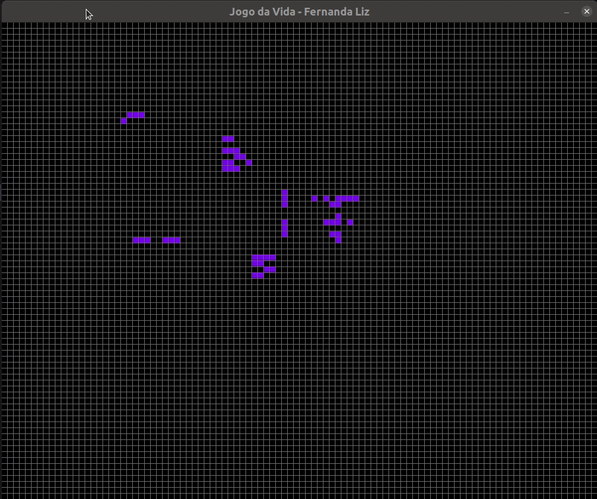
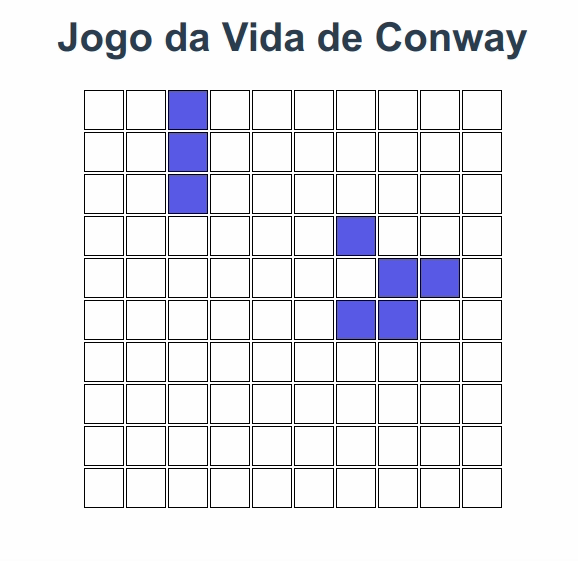

# Conway's Game of Life
Cellular automaton in Python and Vue.JS
## Rules:
- Each cell with one or no neighbors dies, by loneliness.
- Each cell with four or more neighbors dies, by overpopulation.
- Each cell with two or three neighbors survives.
- Each cell with three neighbors becomes alive.
## Project setup Python
```
pip install -r requirements.txt
python3 life.py
```
### How to play
- Select cells and click space to start or pause <br>

Inspired by: [NeuralNine](https://www.youtube.com/watch?v=cRWg2SWuXtM)
## Project setup Vue
```
npm install
```
### Compiles and hot-reloads for development
```
npm run serve
```
 <br>
Inspired by: [Tony Lâmpada](https://plataforma.busertech.com.br/87566-tarefas-buser-tech/2098641-20221221-life-o-jogo-da-vida-em-vue-js)
