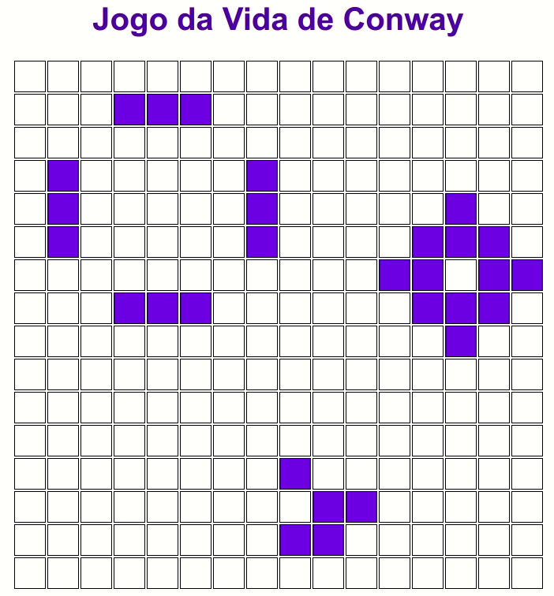

# Conway's Game of Life
Cellular automaton in Python and Vue.JS
## Rules:
- Each cell with one or no neighbors dies, by loneliness.
- Each cell with four or more neighbors dies, by overpopulation.
- Each cell with two or three neighbors survives.
- Each cell with three neighbors becomes alive.
## Project setup Python
```
pip install -r requirements.txt
python3 life.py
```


## Project setup Vue
```
npm install
```
<!--  -->
### Compiles and hot-reloads for development
```
npm run serve
```
